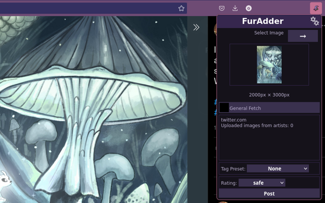

# FurAdder   

A [furbooru.org](https://furbooru.org) image extractor and uploader.



## Installation

- [Chrome](https://chrome.google.com/webstore/detail/furadder/hkipilhknmjcgipemfdgbeahoopaiaac)

- [Firefox](https://addons.mozilla.org/en-US/firefox/addon/furadder)

## Features

- Autofills the upload and fetch forum on furbooru.org.
- Extracts artist name (when available) and applies appropriate aliasing.
- Extracts highest resolution version from the page.
- Allows tag presets for faster tagging.
- Add custom tag presets, configure defaults!
- Forces a rating tag so you won't forget.
- Detects hash-identical reposts before upload.
- Looks for other art by the same artist before upload.
- Universal extraction (pull images from any site!).
- Configurable Keyboard Shortcuts/Hot Keys.

## Intelligently Supported Sites

- twitter.com
- furaffinity.net
- deviantart.com
- derpibooru.org

## Universal Extractor

Any image (not video yet) can be extracted from any site using the
universal extractor whenever a site is not intelligently supported.

## Build Instructions

Building this package requires `npm`, `bash` and 7zip (via `7z` in your $PATH).

```bash
git clone https://github.com/CrystalSplitter/Furadder furadder && cd furadder
npm install
npm run build-ext
```

To clean the build, run:

```bash
npm run clean
```

## Contributing

If you would like to give feature recommendations,
please create an issue, or thumbs-up an existing issue!

Please also see [CONTRIBUTING.md](CONTRIBUTING.md).

## Legalese

This extension is independently developed, and not an official project of furbooru.org.
